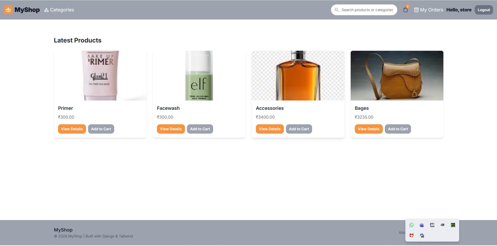
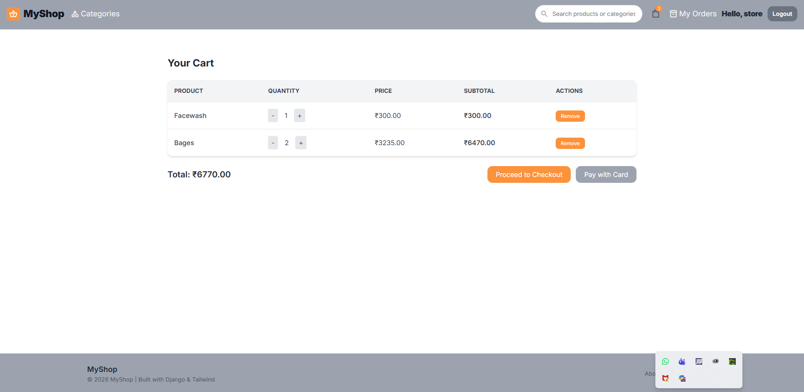
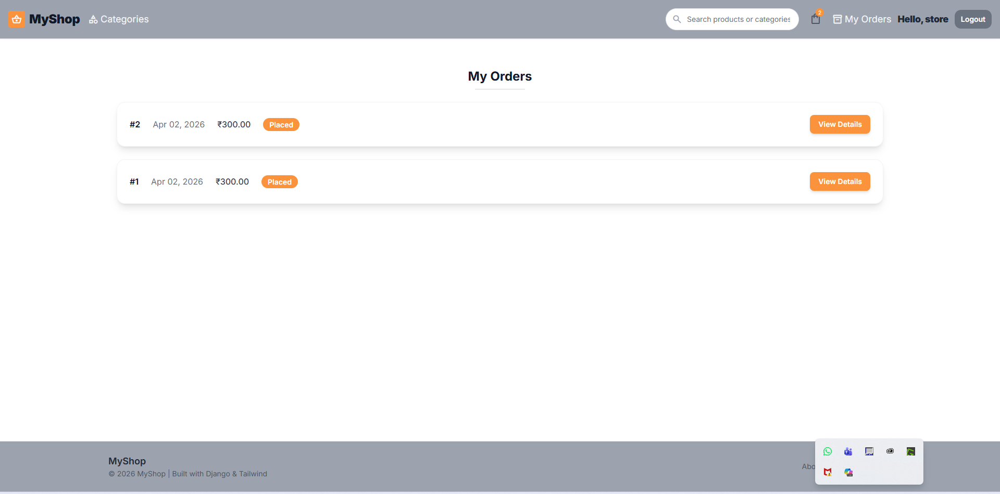
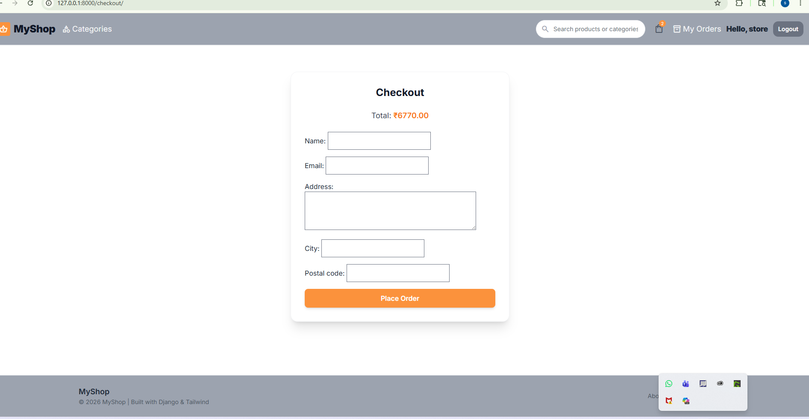

# Django Online Shopping Website

An e-commerce website built using Django.

## Features
- User registration/login
- Product categories
- Shopping cart
- Checkout system
- Order history
- Search products

## Technologies Used
- Django
- Python
- HTML/CSS
- SQLite

## Installation

```bash
git clone https://github.com/soumiyachacko-dev/myshop.git
cd myshop
pip install -r requirements.txt
python manage.py runserver

# Django Online Shopping Website

## Home Page



## Product Detail


## Shopping Cart



## My Orders


## Checkout
